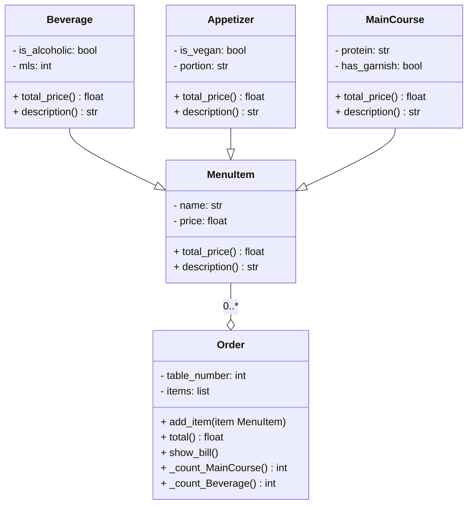

# POO-Reto_3

## Sistema de Facturación de Restaurante
Este proyecto consiste en un sistema básico de gestión de pedidos y facturación para un restaurante desarrollado en Python bajo el paradigma de Programación Orientada a Objetos (POO). El código permite organizar los elementos del menú en diferentes categorías como **bebidas, entradas y platos fuertes**, aplicando automáticamente reglas de precio específicas (impuestos por alcohol, recargos por porciones compartidas o costos por guarniciones) para generar una cuenta detallada y formateada para cada mesa de forma eficiente.
### Características principales
- **Gestión por categorías:** Uso de herencia para diferenciar comportamientos entre tipos de alimentos.
- **Cálculo dinámico:** Ajuste de precios basado en atributos del producto.
- **Generación de facturas:** El formato legible en consola para el resumen total de la mesa fue con ayuda de la IA.

### Diagrama UML de Clases

